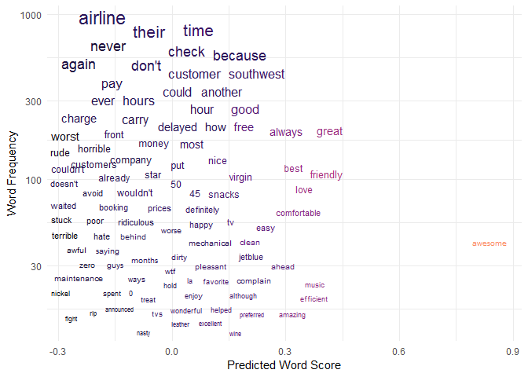

## Introduction

Suppose we are in the business of airline customer satisfaction.  There are many ways we could gauge consumer opinion, from Yelp, Google, or Facebook reviews to Twitter, questionnaires, or email.  In some cases we will have an objective measure of consumer satisfaction, as in the Yelp Star Rating, while in others there is only subjective text available.  Ideally, we wouldn't be limited to gauging sentiment via a numeric rating like Yelp alone.  With this article we hope to build a prediction model that can be applied to text-based consumer opinion regardless of platform.

For this analysis we are going to use publicly available data from **Yelp** and **Twitter**.  This allows us to build a predictive model using customer opinion and rating from *Yelp* and test the model on text-only opinions from *Twitter*.

The *Yelp* data comes from Kaggle, and we have filtered it to contain 1,188 reviews from 15 different airlines between the dates of 2006-06-24 and 2014-07-16.  The median length of a review is 115.00 words, with an average of 856.09 characters.  The average star rating is 2.22.

## A Simple Analysis

We are using R and the package *tidytext* to help us with this exercise.  

We begin with simple counts of words by *Yelp* star rating. 

We see that the following plot tracks closely with our intuition about what a high rating review will look like.  On the right, we see words like "enjoyable", "excellent", and "seamless".  While on the left, the lower star reviews contain words like "difficult", "expensive", and "wtf".

<!-- -->

## Ratings

Because we are working with word counts, the fact that there are many more 1* reviews than any other is likely to influence how some words show up more negative than they might actually be.  

<!-- -->

Next, we'll take a look at how the ratings have changed over time.  We can see that the average review score steadily decreased between early 2013 and mid 2014.  We also notice that the number of monthly reviews increased in this same time period, as represented by the size of the point.  

<!-- -->

## Sentiment Analysis

Now we will delve into the heart of the sentiment analysis, but first we have to identify a sentiment lexicon that fits our use case.  There are plenty of lexicons available for public use, but it can be an arduous task to find one that uniquely matches our intuition of consumer opinion ratings.

#### Pre-Defined Sentiment Lexicon

Let's test out the sentiment lexicon developed by Hu & Liu and used by both **Bing** and **Google** [*](https://www.cs.uic.edu/~liub/FBS/sentiment-analysis.html). This lexicon classifies nearly 7,000 words as either "*positive*" or "*negative*".

We can apply these labels to the words in each review, and get a feel for the labeled sentiment of each review.  

<!-- -->

But how do we know these sentiment labels accurately capture consumer sentiment?  In the sentiment plot shown above, we don't see the connection between negative word sentiment, and the decrease in average ratings over time that we saw earlier.  

In the following plot, we gauge the relation between the *Hu & Liu* sentiment labels and the *Yelp* consumer rating.  We see that the negative label does indeed capture the lower Yelp scores, but the positive label does not capture the higher Yelp scores very well.  

<!-- -->

#### Customized Sentiment Lexicon

One solution to this problem is to create our own sentiment scores.  We have all the necessary information for a machine learning prediction model.  The Yelp data has the raw text and an objective numeric rating indicating the consumer's opinion.  

There is a lot of work going on in the background here, but basically we are building a generalized linear model using the frequency of each word as input and the Yelp star rating as the output.  This, in effect, allows us to start each review with a baseline rating and add or subtract points based on the words that show up in the review.  

With our newly created machine learning model, we demonstrate the predicted versus actual scores for each review.  

<!-- -->

The density plot above indicates our model is not too far off base.  We do note that the predictions tend to hover around the middle, with actual 2\*-4\* being predicted to be quite close to each other.  This just means our model might not perform very well with middle scores.    

However, the plot below shows us the model does indeed address the issue we saw with the *Hu & Liu* sentiment labels.  Our customized scores do a better job of distinguishing between the positive and negative consumer opinions than the established sentiment lexicon. 

<!-- -->

###### Influential Words

Now that we've established our custom sentiment scores, let's take a look at the 20 most influential words in the Yelp data.  This lines up with our intuition of what negative and positive reviews might look like.  Interestingly, words like "nickel" show up as part of the phrase "nickel-and-dime"; along with the word "averaged" when consumers justify their rating as the aggregate of all their experiences with the airline.

<!-- -->

For a larger view of the impact of certain words, let's take a look at the *chatterplot* below.  Words towards the top of the chart show up more often in the reviews, while those towards the right of the chart have a more positive connotation. We see words like "never", "again", and "rude" show up frequently with negative connotations, and words like "great", "friendly", "best" with positive connotations.  

<!-- -->

## Twitter Opinion

Now that we have demonstrated the ML model, lets apply it to some consumer airline opinions shared on Twitter.

First of all, we see that there are 14,485 tweets between 2015-02-17 and 2015-02-24. The average tweet has a median of 19 words and an average of 103.8 characters.  

This is quite different from the size of Yelp reviews we saw earlier.  

When calculating the score of each tweet, we find that there are many 0 score tweets, which are essentially tweets composed of words that our prediction model did not account for.  

<!-- -->

For example, looking at some 0 score tweets, we see many of these tweets are either questions or conversational, as users are more likely to engage in direct dialogue with the airline itself.  

tweet_id    tweet_score  text                                                                                                date                
---------  ------------  --------------------------------------------------------------------------------------------------  --------------------
4487                  0  @SouthwestAir no need, I know the status, you Cancelled Flightled instead of delaying the flight.   2015-02-24 05:20:08 
6652                  0  @SouthwestAir Thanks a ton!                                                                         2015-02-17 09:57:21 
9989                  0  @USAirways has failed me all day long, should I blame it on @AmericanAir ?                          2015-02-22 12:04:34 

So the solution here is simply to remove 0 score tweets, and continue our exploration.

Now we can complete the prediction by converting these tweet scores to the "star rating" units used in the original Yelp prediction model.  In the plot below we see that a majority of the tweets are quite neutral, hovering near ~2.4 stars.  

<!-- -->

If we take a look at a few of the tweets with the highest and lowest scores, we can see that they do indeed match our intuition of what a consumer opinion would look like.   

 stars_predicted  text                                                                                                                                      
----------------  ------------------------------------------------------------------------------------------------------------------------------------------
       0.7839031  @united is the worst. Worst reservation policies. Worst costumer service. Worst worst worst. Congrats, @Delta you're not that bad!        
       1.5077993  @united worst customer service experience ever. 40 minutes to get the jetway to the plane at EWR tonight. Flight 354   Disappointed       
       1.5230742  @USAirways flight 850. RUDE RUDE RUDE service! Awful.                                                                                     
       4.1065552  @AmericanAir awesome flight this morning on AA3230! Awesome crew and even landed early!                                                   
       4.1361838  @VirginAmerica completely awesome experience last month BOS-LAS nonstop. Thanks for such an awesome flight and depart time. #VAbeatsJblue 
       4.3808142  @usairways great crew for flight 504 PHX to YVR tonight! Friendly, efficient. Awesome job.                                                

## Conclusion

To summarise what we've covered here, we've learned that existing sentiment lexicons may not always meet our needs, and that we are able to create our own sentiment scores given the right data.  Yelp is a good tool for building a custom score set, however, as we saw when applied to Twitter comments, the Yelp predictions are based on the long-form opinions unique to Yelp, which may not translate perfectly to the wider variety in consumer communicaitons we find on Twitter.
